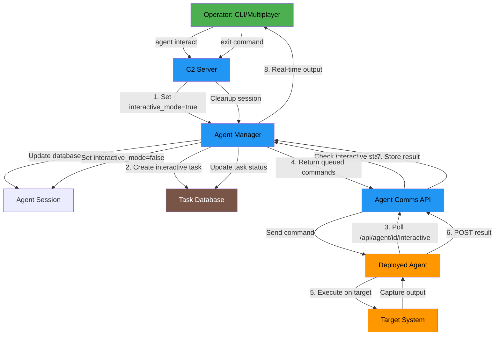

# Communication Protocol 



## Communication Architecture

The Neo C2 Framework uses a web-based architecture where the C2 server exposes HTTP endpoints that agents communicate with. The communication system is designed to be stealthy and evasive, using custom evasive endpoints and multiple protocols under active development for resilience.

### Supported Protocols

- **HTTP/HTTPS** - Primary communication protocol

## Authentication Mechanisms

### Agent Authentication

The Neo C2 Framework implements a robust authentication system using Fernet (symmetric encryption) for secure communication:

1. **Pre-registration**: When an agent is generated, it is pre-registered in the database with a unique agent ID and a secret key (Fernet token)
2. **Initial Registration**: During registration, the agent sends its pre-assigned ID and embedded secret key to prove identity
3. **Secret Key Validation**: The server validates the agent's identity by comparing the provided secret key with the stored key in the database
4. **Encryption**: All subsequent communications are encrypted using the Fernet secret key

### Secret Key Generation

- Secret keys are generated using `Fernet.generate_key()` which creates a 32-byte URL-safe base64-encoded key
- Keys are stored in the database in the `agents` table under the `secret_key` column
- Both server and agent maintain the same secret key for symmetric encryption/decryption

## Registration Process

### Data Exchanged During Registration

**Agent → Server (POST request)**:
```json
{
  "agent_id": "unique-agent-uuid",
  "hostname": "agent-hostname",
  "os_info": "operating-system-info",
  "user": "current-username",
  "listener_id": "web_app_default",
  "interactive_capable": true,
  "secret_key": "fernet-encrypted-token"
}
```

**Server → Agent (Response)**:
```json
{
  "status": "success",
  "agent_id": "unique-agent-uuid",
  "message": "Agent registered successfully",
  "secret_key": "fernet-encrypted-token",
  "checkin_interval": 30,
  "jitter": 5
}
```

### Registration Flow

1. **Agent Initialization**: Agent starts with pre-assigned ID and embedded secret key
2. **Registration Request**: Agent sends registration data to `/api/users/register` endpoint
3. **Server Validation**: Server validates the agent's identity using the secret key
4. **Database Update**: Server updates agent record with current IP, hostname, OS info
5. **Response**: Server returns success status, check-in interval, and jitter values
6. **Agent Configuration**: Agent configures heartbeat interval and jitter based on server response

## Task and Result Communication

### Task Retrieval

**Agent → Server (GET request)**:
- Endpoint: `/api/users/{agent_id}/profile`
- Headers: Standard HTTP headers with User-Agent
- No request body required

**Server → Agent (Response)**:
```json
{
  "status": "success",
  "tasks": [
    {
      "id": "task-uuid",
      "command": "encrypted-command-payload",
      "created_at": "timestamp"
    }
  ],
  "interactive_mode": false
}
```

### Task Execution and Result Submission

**Agent → Server (POST request)**:
```json
{
  "task_id": "task-uuid",
  "result": "encrypted-result-payload"
}
```

**Server → Agent (Response)**:
```json
{
  "status": "success",
  "message": "Result received",
  "task_id": "task-uuid"
}
```

### Task Data Format

- **Commands**: Sent encrypted using the agent's secret key
- **Results**: Sent encrypted using the agent's secret key
- **Task Types**: Support for various command types including:
  - Standard shell commands
  - PowerShell scripts (base64 encoded)
  - File upload/download operations
  - Direct shell connections
  - Sleep interval changes
  - Agent self-deletion
  - BOF (Beacon Object File) execution
  - .NET assembly execution
  - Shellcode injection
  - PE injection
  - Reverse proxy operations

## Interactive Communication

### Interactive Mode

The framework supports interactive communication where operators can send commands in real-time:

**Status Check**:
- Agent → Server: GET `/api/users/{agent_id}/status`
- Response: Interactive mode status and pending command status

**Command Retrieval**:
- Agent → Server: GET `/api/users/{agent_id}/settings`
- Response: Interactive command if available

**Result Submission**:
- Agent → Server: POST `/api/users/{agent_id}/settings`
- Payload: Task ID and result data

### Interactive Task Flow

1. **Mode Detection**: Agent periodically checks if it should enter interactive mode
2. **Command Polling**: In interactive mode, agent polls for commands every 2 seconds
3. **Command Execution**: Agent executes received commands immediately
4. **Result Submission**: Agent submits results back to server
5. **Mode Exit**: Server can signal agent to exit interactive mode

## Endpoint Discovery and Dynamic Routing

The framework implements an endpoint auto-discovery system that:

1. **Scans Profiles**: Automatically discovers endpoints defined in profile configurations
2. **Registers Handlers**: Maps discovered endpoints to appropriate handler functions
3. **Supports Multiple Formats**: Handles both static and dynamic endpoints with agent_id placeholders
4. **Listener Integration**: Discovers endpoints from running listeners and integrates them

### Profile-Defined Endpoints

Profiles can define custom endpoints in the configuration:
```json
{
  "endpoints": {
    "register": "/api/users/register",
    "tasks": "/api/users/{agent_id}/profile",
    "results": "/api/users/{agent_id}/activity",
    "interactive": "/api/users/{agent_id}/settings",
    "interactive_status": "/api/users/{agent_id}/status",
    "download": "/api/assets/main.js"
  }
}
```

## Data Encryption and Security

### Encryption Mechanism

- **Algorithm**: Fernet (symmetric encryption based on AES 128 in CBC mode)
- **Key Format**: 32-byte URL-safe base64-encoded keys
- **Encryption Process**: 
  1. Data is converted to string/JSON format
  2. Encrypted using Fernet with the agent's secret key
  3. Result is base64-encoded for transport
- **Decryption Process**: Reverse of encryption with proper error handling

### Data Protection

- All command and result data is encrypted end-to-end
- Secret keys are stored securely in the database
- Communication includes proper error handling for failed decryption
- Fallback to unencrypted communication if encryption fails (with logging)


## Failover and Resilience

### Failover Mechanism

The framework includes failover capabilities:

1. **Failure Detection**: Tracks communication failures and increments failure counter
2. **Failover Trigger**: Switches to backup C2 servers after configurable failure threshold
3. **Recovery**: Returns to primary C2 when communication is restored
4. **Multiple Backup URLs**: Supports multiple failover URLs in sequence

### Configuration

- **Max Fail Count**: Configurable threshold before failover (default: 15)
- **Failover URLs**: List of backup C2 server URLs
- **Recovery Logic**: Automatic return to primary C2 after successful communication

## Reverse Proxy and SOCKS5 Support

### Reverse Proxy Functionality

The framework supports reverse proxy capabilities:

1. **Agent as SOCKS Server**: Agent implements SOCKS5 server functionality
2. **Server as SOCKS Client**: C2 server acts as SOCKS5 client
3. **CLI Integration**: Separate SOCKS proxy for CLI connections to agents
4. **Bidirectional Relay**: Data relay between CLI and agent connections

### SOCKS5 Implementation

- **Handshake**: Standard SOCKS5 handshake with no authentication
- **Connection Forwarding**: Forwards SOCKS requests to target destinations
- **Data Relay**: Bidirectional data relay between connections
- **Multiple Clients**: Supports multiple concurrent SOCKS clients

## Working Hours and Kill Date

### Time-Based Controls

The framework implements time-based execution controls:

1. **Working Hours**: Configurable time windows for agent operation
2. **Kill Date**: Predefined date/time for agent self-deletion
3. **Timezone Support**: UTC and local timezone handling
4. **Day Restrictions**: Configurable days of week for operation

### Configuration

- **Start/End Hours**: Time range for agent activity
- **Days**: Days of week when agent is active (1=Monday, 7=Sunday)
- **Kill Date**: ISO format timestamp for self-deletion
- **Stealth**: Agents sleep outside working hours

## Sandbox Evasion

### Evasion Techniques

The agent includes multiple sandbox detection and evasion techniques:

1. **Hardware Detection**: CPU count, RAM, disk space checks
2. **Process Analysis**: Detection of analysis tools and sandboxes
3. **Network Tools**: Detection of monitoring tools
4. **Virtualization**: Detection of VM artifacts
5. **Timing Analysis**: Detection of accelerated execution

### Self-Deletion

- **Automatic**: Agent self-deletes if sandbox detected
- **Stealth**: Uses PowerShell for file deletion after delay
- **Persistence**: Attempts multiple deletion methods

## Communication Endpoints

### Default Endpoints

The framework uses disguised endpoint names to blend with legitimate traffic:

- **Registration**: `/api/users/register`, `/api/analytics/track`
- **Task Retrieval**: `/api/users/{agent_id}/profile`, `/api/users/settings`, `/api/v1/updates`
- **Result Submission**: `/api/users/{agent_id}/activity`, `/api/analytics/data`
- **Interactive**: `/api/users/{agent_id}/settings`, `/api/agent/{agent_id}/interactive`
- **Status**: `/api/users/{agent_id}/status`, `/api/agent/{agent_id}/interactive/status`
- **Download**: `/api/assets/main.js`, `/api/assets/{filename}`

### Dynamic Endpoint Handler

The framework includes a catch-all handler that:
- Matches dynamic endpoints with agent_id placeholders
- Supports regex pattern matching
- Routes to appropriate handlers based on endpoint configuration
- Provides fallback for unknown endpoints

## Security Considerations

### Data Protection

- All sensitive data encrypted end-to-end
- Secret keys stored securely in database
- No plaintext command or result data in transit
- Proper error handling to prevent information leakage

### Authentication

- Strong agent authentication using pre-shared keys
- Identity validation during registration and check-ins
- Session management with periodic re-authentication
- Secure key generation and storage

### Evasion Techniques

- Jitter and randomized timing
- Custom endpoint names
- Sandbox and debugger detection
